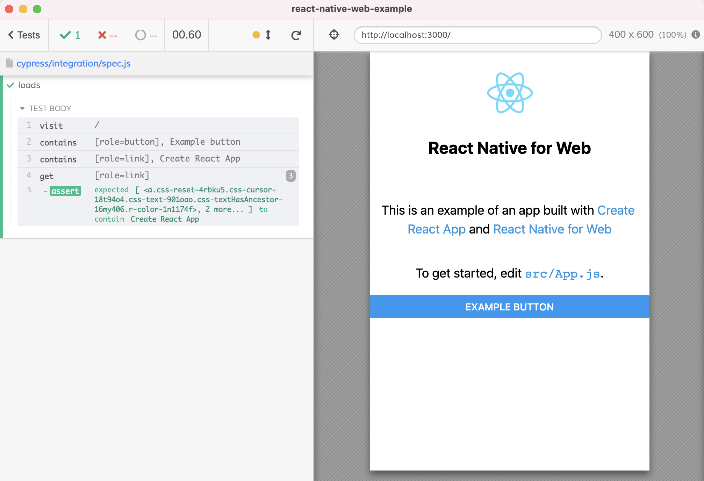

# react-native-web-example
> [React Native for Web](https://necolas.github.io/react-native-web/) starter [template](https://codesandbox.io/s/react-native-q4qymyp2l6)

## Install and use

- `npm install`
- `npm start`

Should open the app in your browser at `localhost:3000`

From another terminal open Cypress using `npx cypress open` and click on the spec

## Videos

- [Add Cypress Test To React-Native-Web Example](https://youtu.be/rADMQUpUpSc)
- [Add Cypress Custom Commands To Access Elements By Aria Role](https://youtu.be/fg5ituAWexQ)
